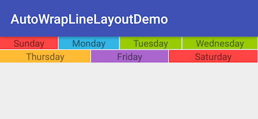
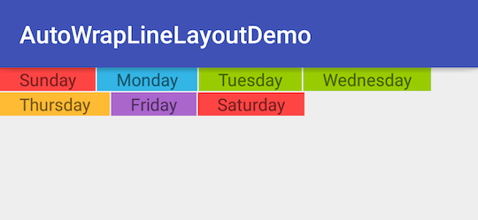

# AutoWrapLineLayoutDemo
One custom layout that can place views horizontally and auto wrap line.

## Samples
### MODE_FILL_PARENT


### MODE_WRAP_CONTENT


## Usage
### Dependency
In your project level build.gradle, add the below script.

```grovy
repositories {
    maven {
        url 'https://dl.bintray.com/hector1990/maven'
    }
}                       
```


Add the below dependency in your app level build.gradle. Make sure your project level build.gradle includes the jcenter() repository.

```grovy
compile 'cn.wolfspider:autowraplinelayout:1.0.1'
```

### How to use
In your layout file, add the AutoWrapLineLayout.

```xml
<cn.wolfspider.autowraplinelayout.AutoWrapLineLayout
            android:id="@+id/auto_wrap_line_layout"
            android:layout_width="match_parent"
            android:layout_height="match_parent"
            autoWrapLineLayout:verticalGap="1dp"
            autoWrapLineLayout:horizontalGap="1dp"
            autoWrapLineLayout:fillMode = "0">
            
            /** any view you want to add **/
            .......
           
</cn.wolfspider.autowraplinelayout.AutoWrapLineLayout>
```

### Style
The layout has two style: MODE_FILL_PARENT = 0 and MODE_WRAP_CONTENT = 1. The default value is 1. I gave samlpes in the top to describe the differences of the two modes.

You can set the style in xml or in java.
####xml
Set the autoWrapLineLayout:verticalGap, autoWrapLineLayout:horizontalGap and autoWrapLineLayout:fillMode values.

```Xml
<cn.wolfspider.autowraplinelayout.AutoWrapLineLayout
            android:id="@+id/auto_wrap_line_layout"
            android:layout_width="match_parent"
            android:layout_height="match_parent"
            autoWrapLineLayout:verticalGap="1dp"
            autoWrapLineLayout:horizontalGap="1dp"
            autoWrapLineLayout:fillMode = "0">
            
            /** any view you want to add **/
            .......
           
</cn.wolfspider.autowraplinelayout.AutoWrapLineLayout>
```
#### Java

```java
mAutoWrapLineLayout.setHorizontalGap(10);
mAutoWrapLineLayout.setVerticalGap(10);
mAutoWrapLineLayout.setFillMode(AutoWrapLineLayout.MODE_FILL_PARENT);
```


## Contact me
If you have any question or advice, please contact me:
<hector1990.troy@gmail.com>

## License
<pre>Copyright 2016 Hector1990

Licensed under the Apache License, Version 2.0 (the "License");
you may not use this file except in compliance with the License.
You may obtain a copy of the License at

   http://www.apache.org/licenses/LICENSE-2.0

Unless required by applicable law or agreed to in writing, software
distributed under the License is distributed on an "AS IS" BASIS,
WITHOUT WARRANTIES OR CONDITIONS OF ANY KIND, either express or implied.
See the License for the specific language governing permissions and
limitations under the License.</pre>
